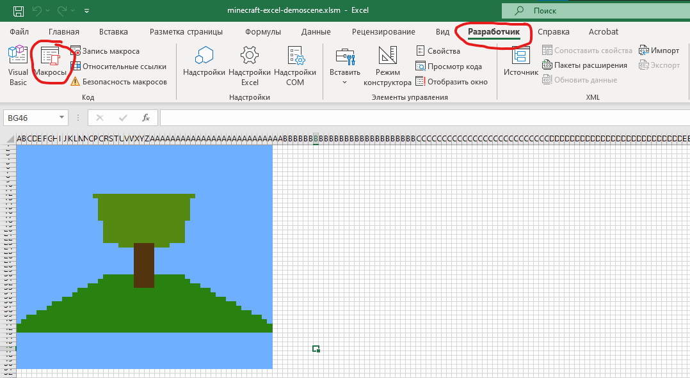
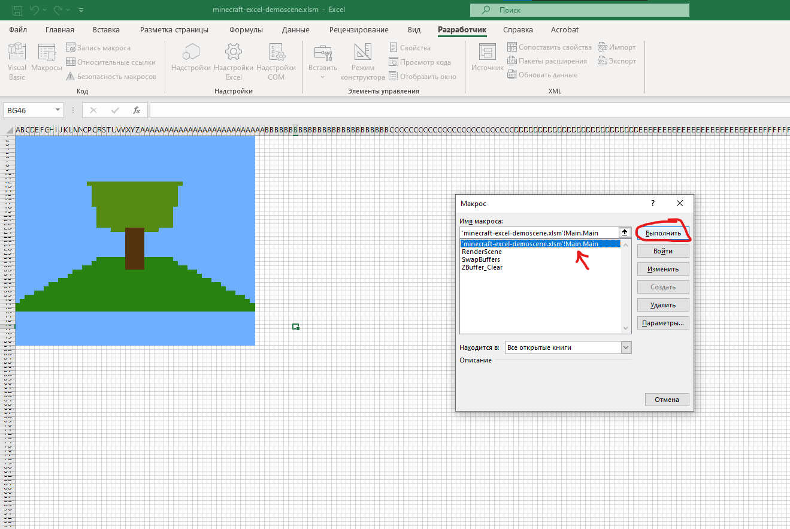

# Minecraft demoscene in Excel

just for fun

---

---

I made renderer in Excel using cell colors (use as pixels) and VBA to calculations

## How to run?

1. Download Excel file: https://github.com/malikzh/minecraft-excel/raw/master/minecraft-excel-demoscene.xlsm
2. Open it in Excel

Next, click to the Developer Tab -> Macros:

And run this macros:

